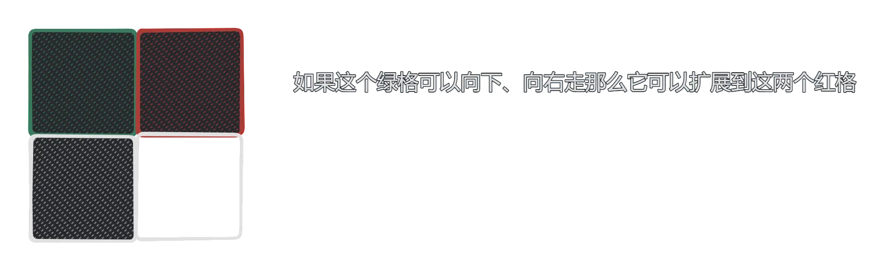

## 题目传送门

[洛谷P1588 Catch That Cow](https://www.luogu.com.cn/problem/P1588)

## 题目大意（乱搞awa）

~~在数轴上有一动点x和一定点y，点x每秒前进一个单位长度或后退一个单位长度或移动到当前位置坐标*2的点，问点x到点y最短要几秒~~

## 题目分析

很容易看出这是一道广搜（BFS）题（其实我没看出来qwq，我太蒻了）。在这道题目中一个点可以通过三种方式(如题)移动，也就是一个点（$x$）只能扩展到三个点，即$x+1$,$x-1$，$2*x$这三个点。所以我们可以采用广搜的方式，用一个队列来记录没有走过的点，同时记录该点的步数，如果这个点等于奶牛的位置就可以输出步数了

### 广搜是什么？

[OI Wiki直达](https://oi-wiki.org/graph/bfs/)

我的理解：首先用一个队列（可以使STL也可以是手写的）记录初始值，只要队列不为空就循环，扩展该值的可以到达的几个值，再将这几个值入队，知道找到答案。



### 广搜和深搜的用法区别

> 同样是寻找目标解，深度优先搜索寻找操作步骤字典序最小的解，而广度优先搜索可以找到步骤最少的解。需要根据题目的性质来决定使用什么搜索算法。
>
> By 深基

## 上代码

### 广搜

```c++
// P1588
#include <bits/stdc++.h>
using namespace std;
const int MAX = 100005; // 定义边界值（10^5）
int ans[MAX];           // 定义答案（步数）数组
void bfs(int x, int y)  // 广搜函数
{
    memset(ans, 0, sizeof ans); // 因为有多组数据，所以每次数组都要清零
    queue<int> q;               // 广搜用队列
    q.push(x);                  // 将初始值（农夫的坐标）入队
    ans[x] = 0;                 // 初始位置到初始位置的坐标是0，如果x==y输出0
    while (!q.empty())          // 如果队列不为空就循环
    {
        int hd = q.front();          // 记录队首元素
        q.pop();                     // 队首元素出队
        if (hd == y)                 // 如果当前元素等于奶牛的位置，说明农夫抓到了牛
            cout << ans[hd] << endl; // 输出当前元素所用步数
        // 农夫有三种走法：1.前进一步    2.后退一步    3.走（瞬移）到当前坐标*2的点
        if (hd + 1 <= MAX && ans[hd + 1] == 0) // 1.前进一步，如果前进后点的坐标没有越界并且前进后的点没有被走过
        {
            ans[hd + 1] = ans[hd] + 1; // 前进后点的步数为当前点+1
            q.push(hd + 1);            // 走过了，将该元素入队
        }
        if (hd - 1 >= 0 && ans[hd - 1] == 0) // 2.后退一步，如果后退的点不小于0且没有被走过 PS：要>=0不能是>=x 因为当x=5 y=8时 走法为（5-1）*2
        {
            ans[hd - 1] = ans[hd] + 1; ////后退的点的步数为当前点+1
            q.push(hd - 1);            // 走过了，将该元素入队
        }
        if (hd * 2 <= MAX && ans[hd * 2] == 0) // 3.走到当前坐标*2的点，如果*2的点没有越界且没走过 PS：要<=MAX不能是<=y 因为当x=5 y=9时 走法为（2*5）-1
        {
            ans[hd * 2] = ans[hd] + 1; //*2后的点的步数为当前点+1
            q.push(hd * 2);            // 走过了，将该元素入队
        }
    }
}
int main()
{
    int t; // 总共有t组数据
    cin >> t;
    while (t--) // 循环输入t次
    {
        int x, y;
        cin >> x >> y; // 输入农夫和牛的坐标
        bfs(x, y);     // 广搜
    }
    return 0;
}

```

[AC记录](https://www.luogu.com.cn/record/122889221)

### 深搜

~~我不会~~

[看这位大佬的吧awa](https://www.luogu.com.cn/blog/wzsyyh/solution-p1588)
